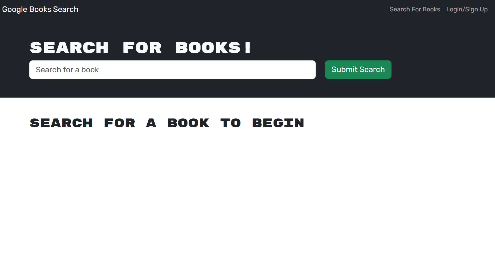
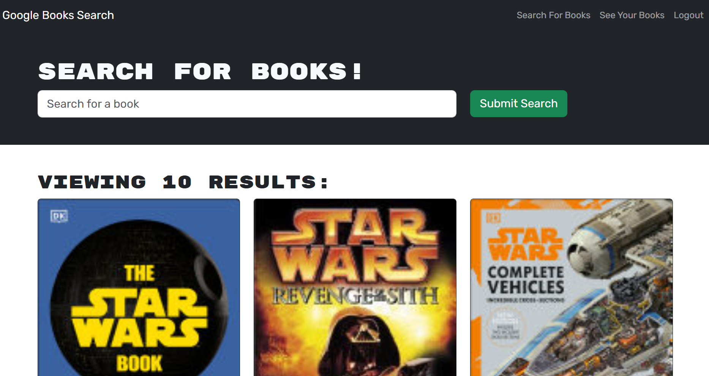
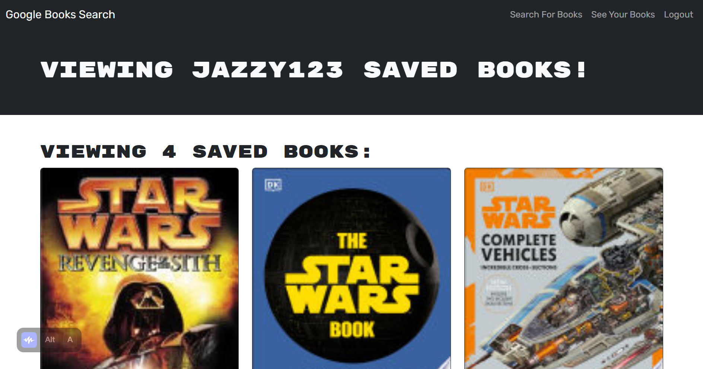

#  Book Search Engine

## Description

This is a full-stack application that allows users to search for books using the Google Books API and save their favorite books. The application is built with React on the client side and Node.js with Express and Apollo Server on the server side. It uses MongoDB for data storage and JWT for authentication.

## Table of Contents

- [Installation](#installation)
- [Usage](#usage)
- [Features](#features)
- [Technologies](#technologies)
- [License](#license)

## Installation

1. Clone the repository:
   
   git clone https://github.com/Thida612/book-search-engine.git
   cd book-search-engine
   

2. Install dependencies for both client and server:
   
   npm run install
   

3. Create a `.env` file in the server directory and add your MongoDB URI and JWT secret key:
   
   MONGODB_URI=your-mongodb-uri
   JWT_SECRET_KEY=your-secret-key
   

4. Build  projectthe:
   
   npm run build
   

## Usage

1. Start the development server:
   
   npm run develop
   

2. Open your browser and navigate to `http://localhost:3000` to use the application.

## Features

- User authentication with JWT
- Search for books using the Google Books API
- Save favorite books to the user's profile
- View and remove saved books

## Technologies

- **Client:**
  - React
  - React Router
  - Apollo Client
  - Bootstrap
  - Vite

- **Server:**
  - Node.js
  - Express
  - Apollo Server
  - MongoDB
  - Mongoose
  - JWT

## License

This project is licensed under the MIT License.

## Deployed Link 
https://book-search-engine-r1su.onrender.com

